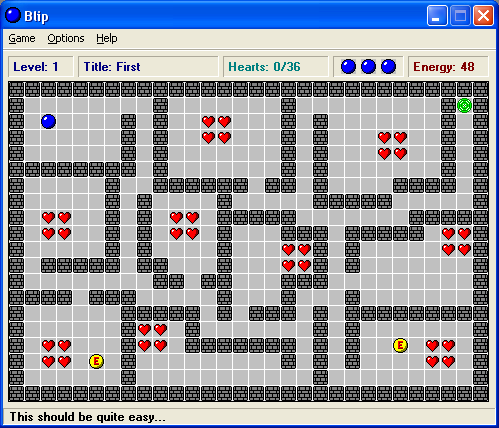
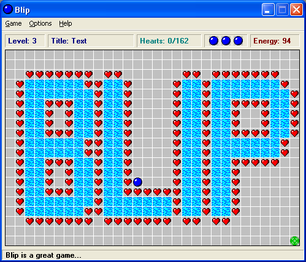
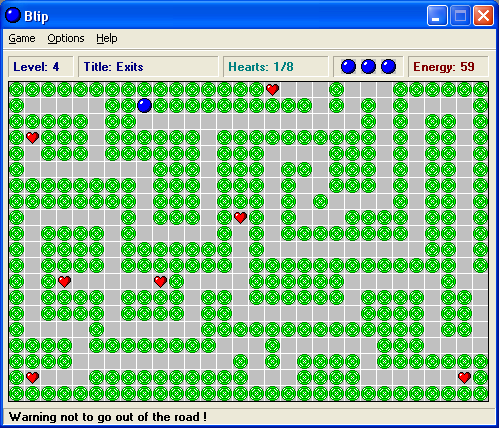
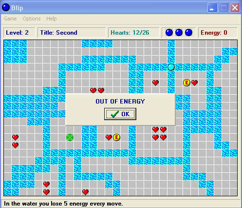
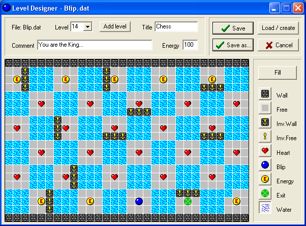

# BLIP

A remake of the Giulio Ferrari's freeware Blip game originally released in 1998 for Windows 95 and 98.

# Lore
One of the first game sources I had the opportunity to read was a game called Blip, written in Delphi and released as freeware by Giulio Ferrari in 98 (according to [this Internet Archive entry](https://archive.org/details/Blip_1020)).

As a young computer engineering student, it was an awesome experience. I played the game for some time and learned a lot of object-pascal language. I have quite a nice feeling about this remembrance... Thanks, Guilio Ferrari, whoever you are.

Backed by this feeling I decided to rewrite the game and adapt it to a more modern standard. And here we are.

# Project goals

- [ ] update graphics to a higher resolution
- [ ] animation support (sprite sheets?)
- [ ] add phisics to the ball
- [ ] plublish a windows version build in modern Delphi
- [ ] publish a web version based on canvas or webGL

# Original Game Screenshots
Some screenshots of the original game running on Windows 98 (or maybe Window 95)

<section class="image-gallery">

</section>

